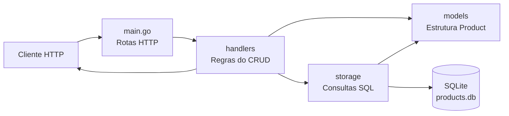

# API Products

API REST simples para gerenciamento de produtos, desenvolvida em Go com o pacote padrão `net/http`, persistência em SQLite e organização em pacotes de handlers, modelos e armazenamento.

O projeto implementa operações de criação, consulta, atualização e exclusão (CRUD). Os produtos são armazenados no arquivo `products.db` e permanecem disponíveis após a reinicialização da aplicação.

## Tecnologias

- Go 1.26.3
- `net/http`
- `encoding/json`
- SQLite
- [`modernc.org/sqlite`](https://pkg.go.dev/modernc.org/sqlite)

## Como executar

### Pré-requisitos

Tenha o [Go](https://go.dev/dl/) instalado em sua máquina.

### Iniciando a API

```bash
go run .
```

Na primeira execução, as dependências são baixadas e o arquivo `products.db` é criado automaticamente no diretório do projeto. A tabela `products` também é criada caso ainda não exista.

O servidor estará disponível em:

```text
http://localhost:8000
```

## Arquitetura

- `main.go`: inicializa o servidor e registra as rotas.
- `handlers`: recebe as requisições HTTP e gera as respostas JSON.
- `models`: define a estrutura de dados de um produto.
- `storage`: inicializa o SQLite e executa as operações no banco de dados.
- `products.db`: armazena os produtos de forma persistente.

## Diagrama da API



## Modelo de produto

```json
{
  "id": 1,
  "name": "Monitor",
  "price": 700
}
```

| Campo | Tipo | Descrição |
| --- | --- | --- |
| `id` | inteiro | Identificador gerado pela API |
| `name` | string | Nome do produto |
| `price` | decimal | Preço do produto |

## Endpoints

| Método | Rota | Descrição | Resposta de sucesso |
| --- | --- | --- | --- |
| `GET` | `/products` | Lista todos os produtos | `200 OK` |
| `POST` | `/products` | Cria um produto | `201 Created` |
| `GET` | `/products/{id}` | Busca um produto pelo ID | `200 OK` |
| `PUT` | `/products/{id}` | Substitui os dados de um produto | `200 OK` |
| `DELETE` | `/products/{id}` | Exclui um produto | `204 No Content` |

IDs inválidos ou corpos JSON malformados retornam `400 Bad Request`. Quando o produto não existe, a API retorna `404 Not Found`. Falhas de acesso ao banco de dados retornam `500 Internal Server Error`.

## Exemplos de uso

### Listar produtos

```bash
curl http://localhost:8000/products
```

### Criar um produto

```bash
curl -X POST http://localhost:8000/products \
  -H "Content-Type: application/json" \
  -d '{"name":"Mouse","price":80}'
```

### Buscar um produto

```bash
curl http://localhost:8000/products/1
```

### Atualizar um produto

```bash
curl -X PUT http://localhost:8000/products/1 \
  -H "Content-Type: application/json" \
  -d '{"name":"Monitor Full HD","price":1200}'
```

### Excluir um produto

```bash
curl -X DELETE http://localhost:8000/products/1
```

As mesmas requisições também estão disponíveis no arquivo [`request.http`](request.http), que pode ser executado por extensões como REST Client no VS Code.

## Estrutura do projeto

```text
api-products/
├── handlers/
│   └── product_handlers.go
├── models/
│   └── product.go
├── storage/
│   └── product_storage.go
├── .gitignore
├── go.mod
├── go.sum
├── main.go
├── products.db
├── README.md
└── request.http
```

## Observações

- O SQLite cria e mantém os dados localmente no arquivo `products.db`.
- A tabela `products` é criada automaticamente na inicialização da aplicação.
- O campo `id` é gerado automaticamente pelo SQLite nas criações.
- A operação `PUT` substitui os campos `name` e `price` do produto informado.
